## Aproposdrive AWS & DevOps Assignment

This repository contains my submission for the **AWS & DevOps Intern Assignment** shared by **Aproposdrive Technologies Pvt. Ltd.**

I completed this assignment step by step by following the task instructions provided in the mail.  
The goal was to deploy a simple application using Docker and AWS services and explain the setup clearly with screenshots.

---

## Task 1: Application Setup

For the application, I created a simple **Flask-based user registration app**.  
The frontend collects user details and the backend stores the data in a **MySQL database**.

### Project structure on local system
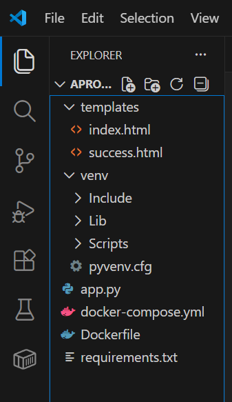

### User registration page
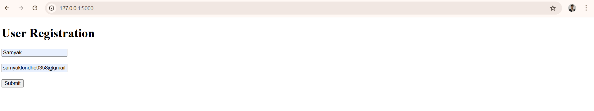

### Form submitted successfully
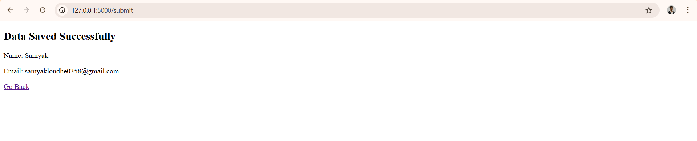

### User data stored in MySQL database
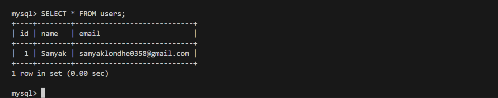

---

## Task 2: Dockerization

The application and database were containerized using **Docker** and **Docker Compose**.  
Both containers were connected using a common Docker network and required ports were exposed.

### Docker image created
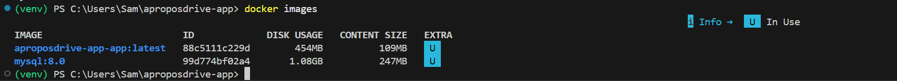

### Running containers using Docker
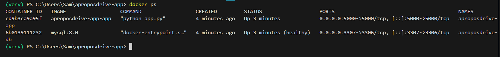

### Docker Compose file used for the setup
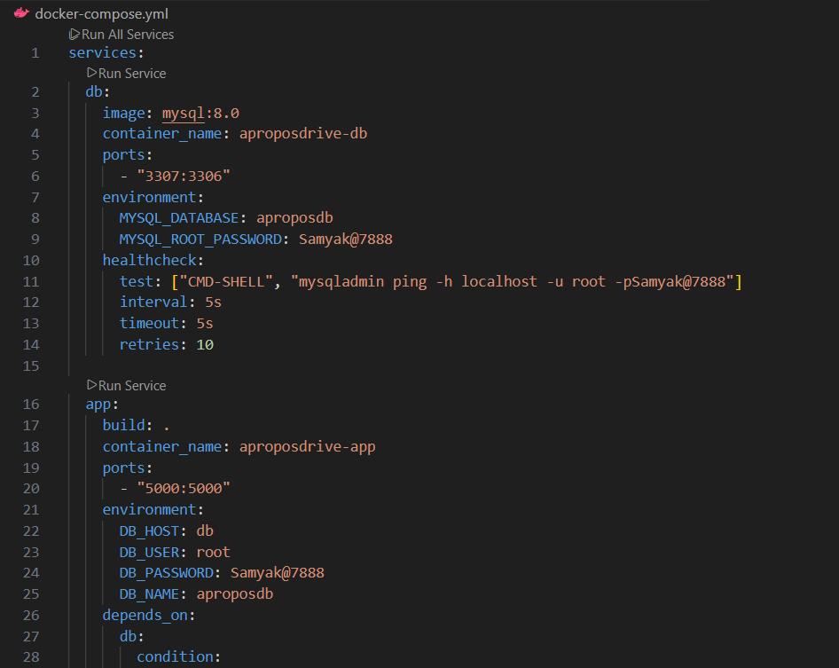

---

## Task 3: Deployment on AWS EC2

A **free-tier eligible EC2 instance** was launched.  
Docker and Docker Compose were installed on the instance and the application was deployed using Docker Compose.

### EC2 instance running
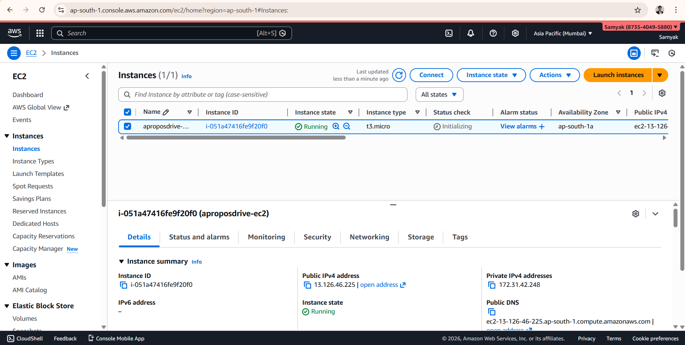

### SSH access to EC2 instance

### Docker and Docker Compose installed on EC2
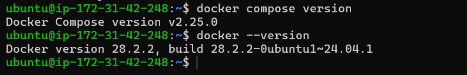

### Application Deploy on EC2 using SCP
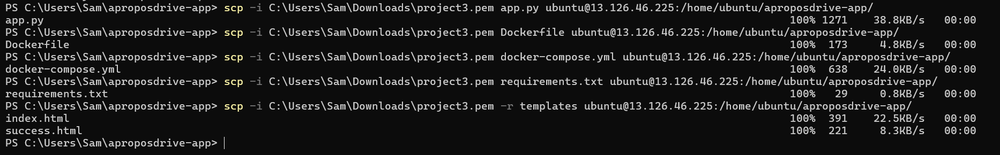

### Application directory structure on EC2
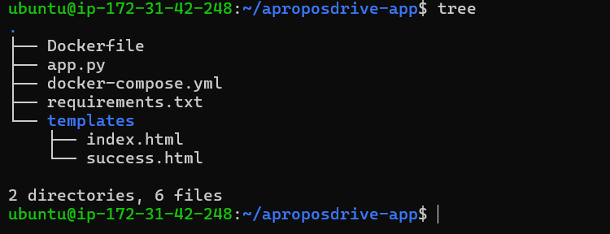

### Containers running on EC2
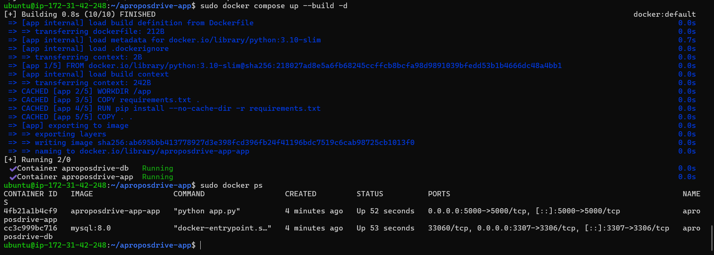

---

## Task 4: Application Access

After deployment, the application was accessed using the **EC2 public IP address** to confirm it was working correctly.

### Application accessed using public IP
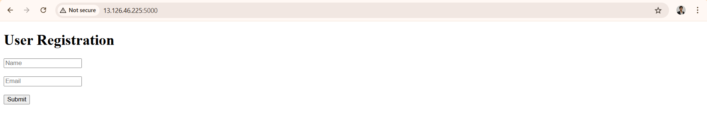

---

## Task 5: Load Balancer and Auto Scaling

To improve availability, an **Application Load Balancer (ALB)** and **Auto Scaling Group (ASG)** were configured.

The application code was pushed to GitHub and used during the deployment.

### Code pushed to GitHub repository
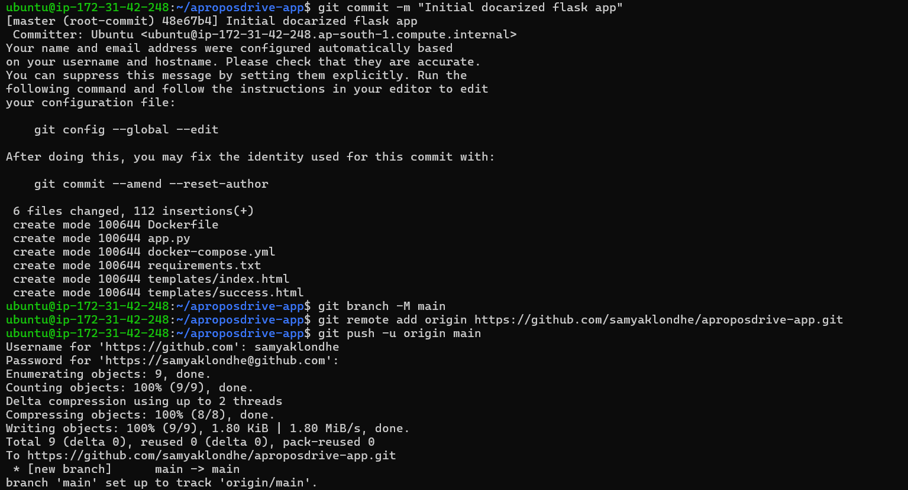

### Application Load Balancer created
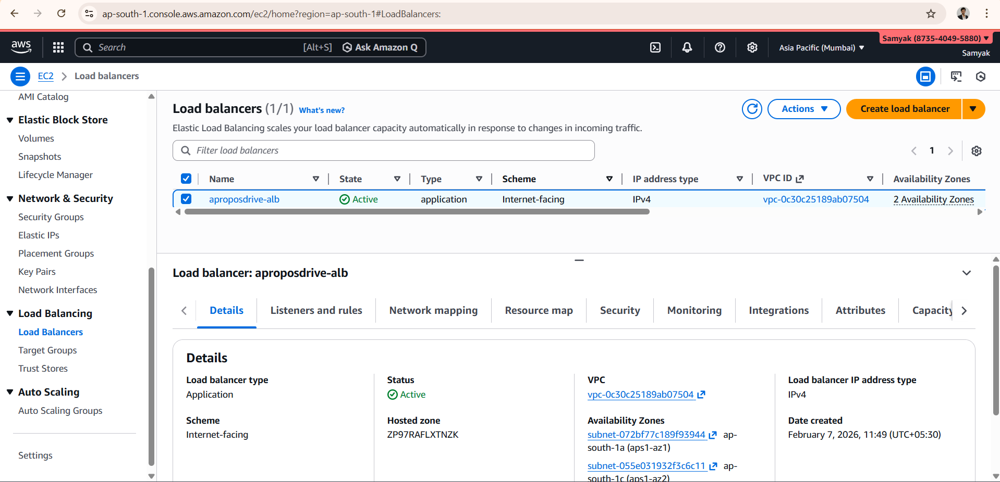

### Load Balancer listener configuration
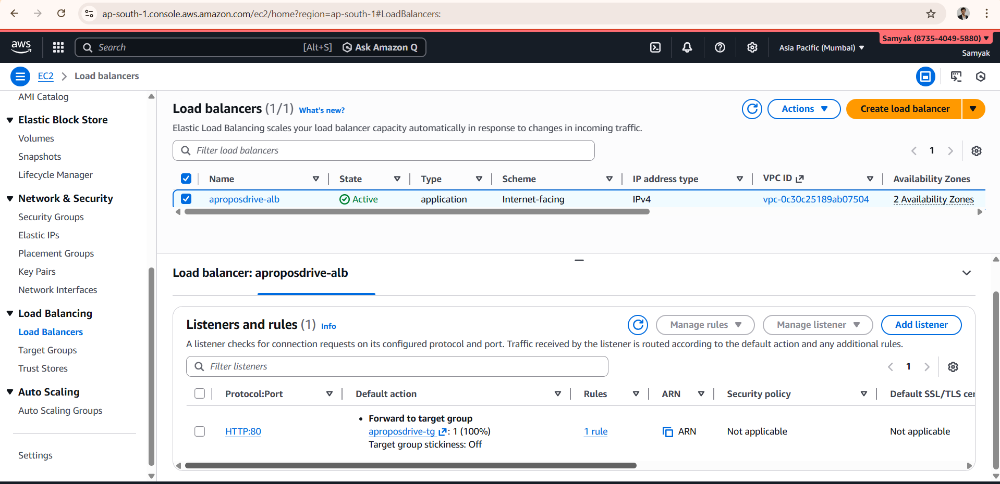

### Auto Scaling Group created
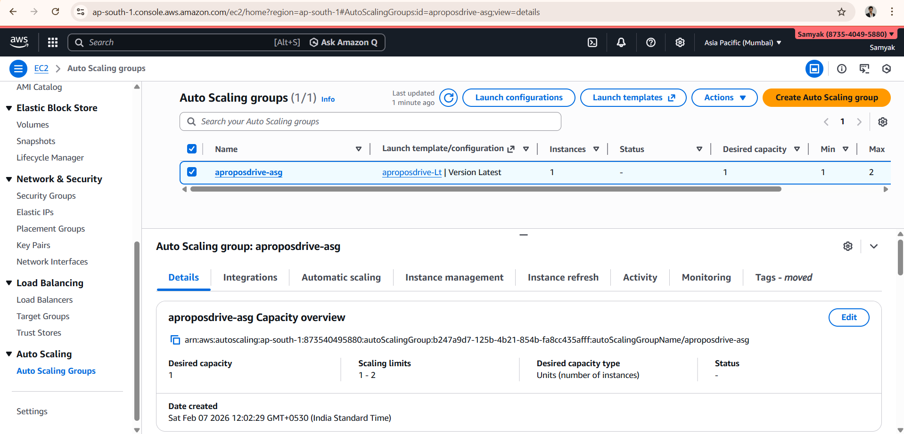

### EC2 instance launched by Auto Scaling Group
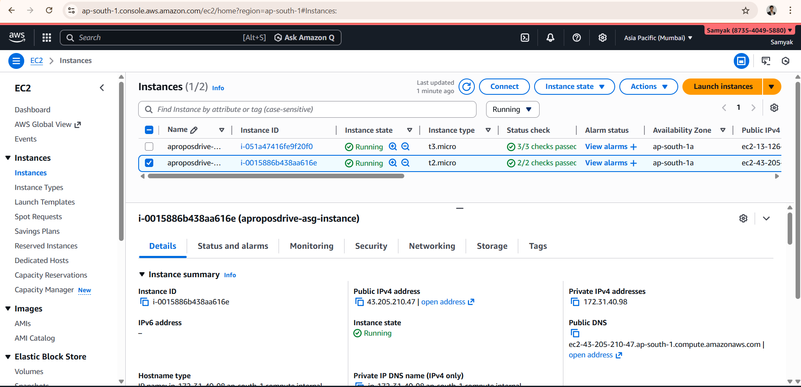

### Target group configuration
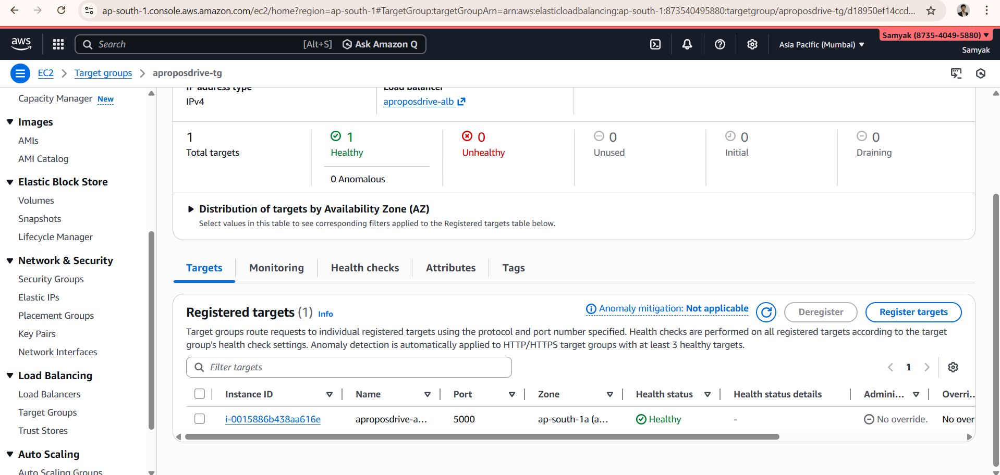

### Free-tier eligible instance type selected
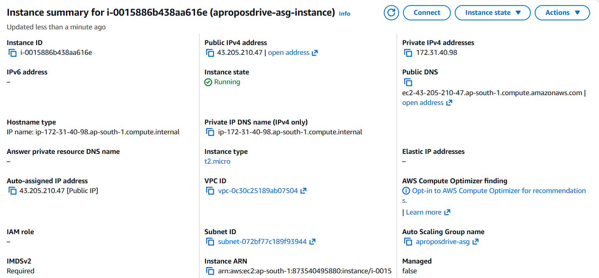

### Desired capacity set to 1
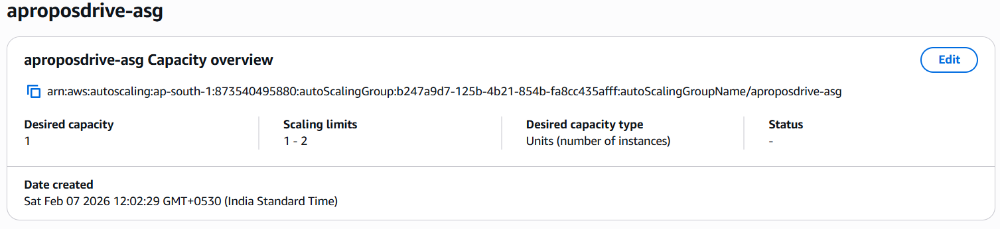

---

## Task 6: Cost Optimization

To keep the setup cost-effective:

- Free-tier eligible EC2 instance was used
- Desired capacity was kept at **1**
- Auto Scaling was enabled to avoid unnecessary resource usage
- Docker was used to reduce system overhead

---

## Task 7: Troubleshooting Explanation

During the setup, the following issues were faced and resolved:

- When the application was not accessible, security group inbound rules were checked.
- When containers were running but the port was not reachable, Docker port mappings were verified.
- When the target group showed unhealthy status, the application was tested locally on the instance using `curl localhost:5000`.

---

## Conclusion

This assignment helped me understand how Dockerized applications are deployed on AWS using EC2, Load Balancer and Auto Scaling.  
